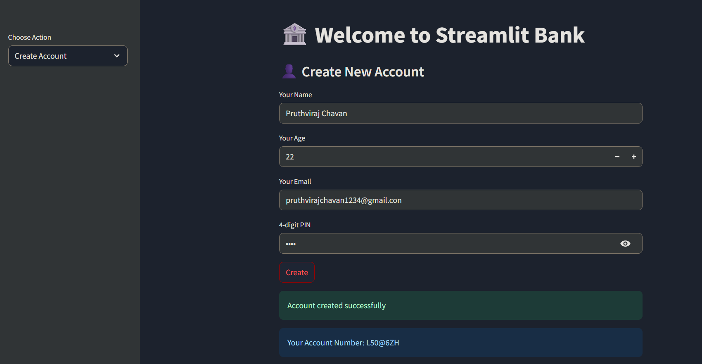

# 🏦 StreamBank App


A simple **banking management system** built with **Streamlit**.  
This project allows users to create and manage accounts with features like deposit, withdrawal, updating info, and deleting accounts — all with a clean web interface.  

---

## ✨ Features

- 👤 Create a new account with unique account number  
- 💰 Deposit money (up to ₹10,000 per transaction)  
- 🏧 Withdraw money (with balance check)  
- 📑 View account details (secured with PIN)  
- ✏️ Update account information (name, email, PIN)  
- 🗑️ Delete account permanently  
- 🔒 PIN-protected authentication for all operations  
- 📂 Data stored locally in a JSON file (`data.json`)  

---

## 📂 Project Structure

```
streambank-app/
│── app.py              # Streamlit frontend (UI + interactions)
│── bank.py             # Backend logic for bank operations
│── requirements.txt    # Required Python libraries
│── data.json           # Auto-generated file to store account data
```

---

## ⚙️ Installation

Clone the repository:

```
git clone https://github.com/PruthvirajChavan45/streambank-app.git
cd streambank-app
```

Create a virtual environment (recommended):

```
python -m venv venv
source venv/bin/activate   # Mac/Linux
venv\Scripts\activate      # Windows
```

Install dependencies:

```
pip install -r requirements.txt
```

---

## ▶️ Usage

Run the Streamlit app:

```
streamlit run app.py
```

By default, the app runs locally at:

👉 [http://localhost:8501/](http://localhost:8501/)  

---

## 📸 Screenshots

### 🏠 Home Page


### 👤 Create Account


### 💰 Deposit Money


---

## 🔮 Future Improvements

- Add transaction history  
- Implement user authentication with email  
- Set up database integration (SQLite / PostgreSQL)  
- Deploy online (Streamlit Cloud / Heroku / etc.)  

---

## 🛠️ Tech Stack

- **Python 3.x**  
- **Streamlit** (UI framework)  
- **JSON** (local storage)  

---

## 👨‍💻 Author

Developed by **Pruthviraj Chavan** ✨  
🔗 [GitHub Profile](https://github.com/PruthvirajChavan45)
